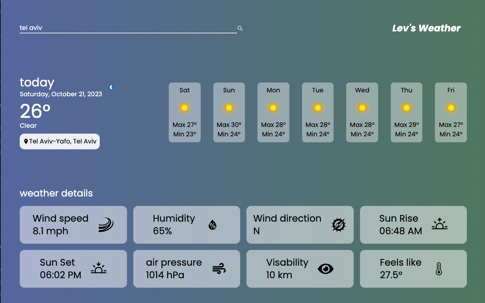

# Weather App

Welcome to the Weather App GitHub repository! This project is a React-based weather application that allows users to check the weather forecast for different cities. It includes various components for displaying current weather, week forecast, and detailed weather information.

# How its built

Built with Next.js, Tailwind CSS, and TypeScript, this Weather App allows users to check the weather forecast for various cities. The application consists of multiple components for displaying current weather, weekly forecasts, and detailed weather information. Users can search for a city, and the app fetches weather data from WeatherAPI to provide up-to-date weather information.

## Project Structure

This project consists of several components that work together to create a functional weather app. Here's an overview of the project structure:

- `page.tsx`: The main component of the application, responsible for rendering the user interface and handling weather data retrieval.
- `weekforecast.tsx`: Component responsible for displaying a week-long weather forecast.
- `weatherdetails.tsx`: Component for displaying detailed weather information, including wind speed, humidity, sunrise, sunset, air pressure, visibility, and feels like temperature.
- `input.tsx`: Input component for searching and selecting a city.
- `current.tsx`: Component responsible for displaying the current weather conditions.

## How to Use

1. Clone this repository to your local machine.

2. Install the required dependencies:
    ```bash
    npm install

4. Obtain an API Key: To use this application, you need to obtain an API key from the WeatherAPI website. Once you have your API key, replace the placeholder in the page.tsx file  with your own key.

5. Run the application:
    ```bash
    npm run dev

7. Access the app in your web browser at http://localhost:3000.

